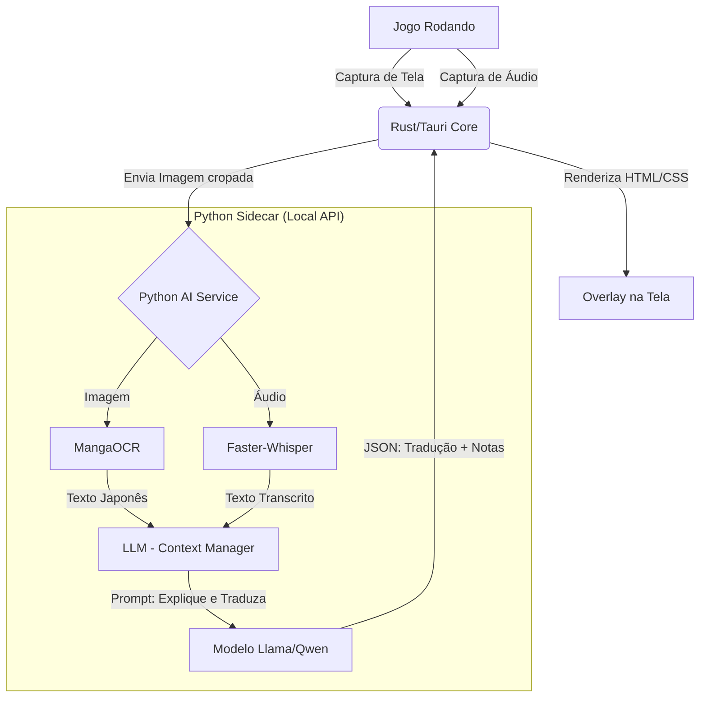

# Documento de Escopo do Projeto: "AbacateOverlay"

## 1. Visão Geral

Desenvolver uma aplicação desktop *cross-platform* que atue como uma camada de sobreposição (overlay) em jogos, capaz de extrair texto (OCR) e áudio (ASR) em tempo real, fornecendo tradução contextual e explicações gramaticais utilizando LLMs (Large Language Models) rodando localmente.

**Diferencial Competitivo:** Substituir a tradução literal "máquina-para-máquina" antiga (Google Translate) por uma "tutoria contextual" via IA, além de oferecer suporte nativo a Linux/Wayland (Steam Deck).

## 2. Objetivos Principais

1. **Captura Inteligente:** Ler textos estilizados (fontes de RPG, pixel art, vertical) que o Tesseract falha em ler.
2. **Contexto:** A tradução deve lembrar das falas anteriores para manter a coerência (ex: pronomes, gênero, enredo).
3. **Multimodalidade:** Aceitar entrada visual (texto na tela) e auditiva (falas sem legenda).
4. **Privacidade e Offline:** Todo o processamento deve ser capaz de rodar localmente (sem APIs pagas, se o hardware permitir).

## 3. Stack Tecnológica (Estado da Arte 2025)

Para este projeto, **Rust** para o cliente/interface (crítico para performance em overlay) e **Python** para o motor de IA.

### A. Frontend & Core (A "Casca")
* **Framework:** **Tauri v2** (Rust + Webview).
* *Por que?* consome frações da RAM do Electron. Permite criar janelas transparentes e "click-through" facilmente.

* **Captura de Tela (Linux/Windows):**
* **Rust crates (xcap ou gstreamer):** Para capturar o buffer da GPU de forma eficiente.
* *Linux Específico:* Suporte obrigatório a **PipeWire** (para rodar em Wayland/Gnome/KDE modernos e SteamOS).

### B. Motor de OCR (O "Olho")
* **Ferramenta:** **MangaOCR**.
* *Modelo:* Baseado no *Vision Transformer (ViT)*.
* *Por que?* É o atual "gold standard" para japonês. Ele foi treinado especificamente com mangás, então lê texto vertical, fontes "rabiscadas" e texto sobre fundo complexo com precisão quase humana. Supera o Tesseract/PaddleOCR drasticamente em jogos.

### C. Motor de Áudio (O "Ouvido")
* **Ferramenta:** **Faster-Whisper** (implementação CTranslate2 do OpenAI Whisper).
* *Modelo:* `large-v3-turbo` ou `distil-medium.en`.
* *Por que?* Permite transcrição em tempo real com baixíssima latência usando GPU ou CPU moderna.

### D. Inteligência & Tradução (O "Cérebro")
* **Orquestração:** **Ollama** (como servidor de inferência local) ou **Llama.cpp-python** (embutido).
* **Modelo Recomendado:**
* *High-end:* **Llama-3 (8B)** ou **Gemma-2 (9B)** ajustados para instrução.
* *Low-end:* **Qwen-2.5 (1.5B)** ou **Phi-3.5** (Roda em qualquer torradeira com alta qualidade linguística).

* *Prompt Engineering:* O sistema deve injetar um "System Prompt" que define a IA como um professor de japonês (sensei).
---

## 4. Arquitetura do Sistema

## 5. Escopo Funcional (MVP - Produto Mínimo Viável)

### Fase 1: O Leitor Visual (Core)
* [ ] Seleção de região da tela (Snipping tool) com atalho global.
* [ ] Envio da imagem para o backend Python (MangaOCR).
* [ ] Pop-up flutuante com o texto extraído editável.
* [ ] Integração com Dicionário Offline (Yomichan/JMDict) para *hover* instantâneo (sem depender de IA para palavras soltas).

### Fase 2: O Tradutor Contextual (IA)
* [ ] Chat interface na overlay: "O que essa frase significa nesse contexto?".
* [ ] Histórico de diálogos (Buffer de 20 linhas) para a IA não "esquecer" o assunto.
* [ ] Botão "Gramática": A IA quebra a frase morfologicamente.

### Fase 3: Suporte a Áudio e Steam Deck
* [ ] Transcrição automática de áudio (se não houver legenda).
* [ ] Otimização para Steam Deck (Game Mode plugin).

## 6. Desafios Técnicos Previstos
1. **Wayland (Linux):** Capturar tela no Wayland é restritivo por segurança. usar portais XDG ou PipeWire corretamente via Rust.
2. **Dependências Python:** Distribuir uma aplicação que depende de PyTorch/CUDA é um pesadelo de tamanho (GBs).
* *Solução:* Usar **ONNX Runtime** sempre que possível para não depender do PyTorch completo no pacote final.

3. **Latência da LLM:** Se o usuário não tiver GPU dedicada, a LLM pode demorar 5-10 segundos para responder.
* *Solução:* UI assíncrona. Mostra a definição do dicionário (instantâneo) enquanto a IA "pensa" na explicação complexa.
